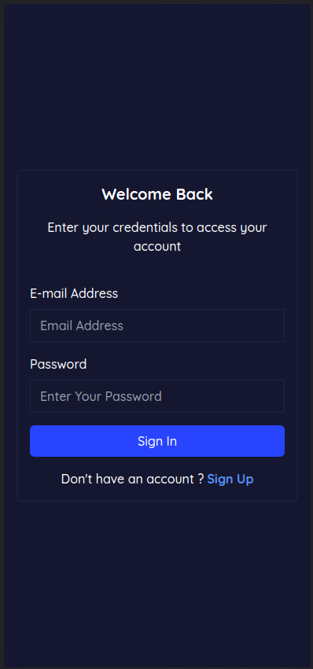

# Mstore

This is a (Next.js APP)[Next.js] and it is bootstrapped with [npx create-next-app@latest](https://nextjs.org/docs/getting-started/installation)

# The Managing store schedule app

## Welcome! 👋

## Content

- [auth-system-app](#)
- [Welcome! 👋](#)
- [The App description](#)
- [Screenshot](#screenshot)
- [Built With](#BuiltWith)
- [Run the app locally](#development)

### The App description


### Screenshot





### Built With

- [Next.js](https://nextjs.org/)
- [React.js](https://reactjs.org/)
- [Tailwind CSS](https://tailwindcss.com/)
- [Prisma.io](https://prisma.io/)
- [Next-auth](https://next-auth.js.org/)

## Steps
- [x] Setting up prisma with sqlite database
- [x] create Database schema 
- [x] create login page ui
- [x] create sign page ui
- [x] create authentication ui
- [x] implement authentication endpoint (`api/auth`)
- [x] implement user registration endpoint business logic (`api/user`)
- [x] 

## Run the app locally

## Getting Started

To get a local copy up and running, please follow these simple steps.

### Prerequisites

Here is what you need to be able to run `Mstore`.

- Node.js (Version: >=16.x <18)
- Yarn _(recommended)_

### Setup

1. Clone the repo on into a public Github repository [https://github.com/gracebir/auth-system-app](https://github.com/gracebir/auth-system-app) by running in you terminal:

```sh
    git clone https://github.com/gracebir/auth-system-app
```

2.  Go to the project folder
```sh
    cd auth-system-app
```

3. Install packages with yarn
```sh
    yarn
```

4. After install dependancies, you need to run prisma migration for seeding up your `sqlite` database by runing:
```sh
    yarn prisma:migrate
```

5. Set up your `.env` file
- Duplicate .env.example to .env
- Use `openssl rand -base64 32` to generate a key and add it under `NEXTAUTH_SECRET` in the `.env` file.
- Use `openssl rand -base64 24` to generate a key and add it under `SECRET_KEY` in the `.env` file
`
6. Run the app with the followin command:

```sh
    yarn dev
```