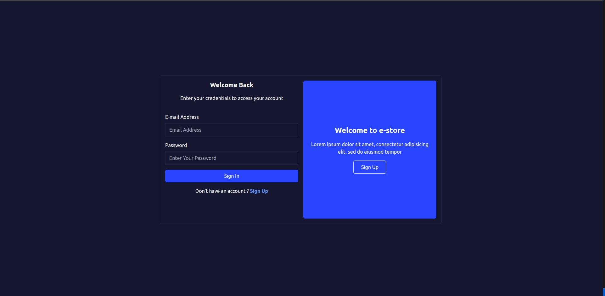

# Per Diem challenge

This is a [Next.js] and bootstrapped with [npx create-next-app@latest](https://nextjs.org/docs/getting-started/installation)

# the Per Diem Store Register challenge

## Welcome! 👋

This is a solution to the Gym Traning. The Gym challenge help us to improve our front-end skills by building realistic projects.
In this exercise, we will use React and tailwindcss.

## Content

- [auth-system-app](#)
- [Welcome! 👋](#)
- [The App description](#)
- [Screenshot](#screenshot)
- [My Steps](#steps)
- [Testing the app locally](#testing-the-app-locally)

### The App description

auth-system-app

### Screenshot

## My process

- Next.js
- Tailwind
- Mobile-first workflow

## Steps

- [x] create login page ui
- [x] create sign page ui
- [x] create authentication ui
- [x] implement authentication endpoint (`api/auth`)
- [x] implement user registration endpoint business logic (`api/user`)
- [x] implement getStore, I am days and time schedule endpoint (`api/store/id` and `api/time/id`)
- [ ] write end to end test with cypress

## Testing the App locally

if you want to test follow these simple steps:

- first clone the repo on [https://github.com/gracebir/auth-system-app](https://github.com/gracebir/auth-system-app) by running in you terminal `git clone https://github.com/gracebir/auth-system-app`
- Then run in your terminal `cd auth-system-app && yarn`
- After install dependancies, you need to run the following command `yarn prisma:migrate`, for seeding your local database
- Once all packages will be install, you will run `yarn dev`